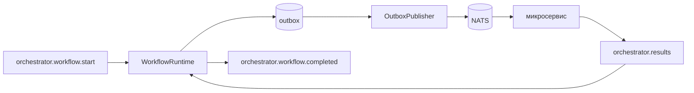

# morington-orchestrator

Универсальный декларативный оркестратор поверх NATS. Принимает декларацию workflow
(DAG из шагов-задач), компилирует её в неизменяемый граф исполнения и надёжно
прогоняет шаги через микросервисы, не зная их предметной области.

## Что это и что это НЕ

Оркестратор исполняет **декларативный DAG задач**: каждый шаг — вызов микросервиса
по NATS-subject; зависимости, фильтры, преобразования данных и политики отказов
описываются в JSON. Это не Temporal: код workflow не исполняется, история не
реплеится.

### Non-goals (1.0)

| Есть у нас | Нет у нас (осознанные non-goals 1.0) |
| --- | --- |
| Статический DAG task-узлов | Исполнение произвольного кода workflow (workflow-as-code) |
| `depends_on`, фильтры, GOTO, middleware | Реплей истории активностей (event-sourced replay) |
| Версионируемые контракты | Child workflows / суб-пайплайны |
| Outbox/inbox, leases, recovery | `fork`/`join`/циклы (заложено в модель, выключено в 1.0) |
| Saga-задел (выключен) | Автоматические компенсации/откаты |

Движок спроектирован workflow-ready: модель `ExecutionGraph`/`ExecutionNode`
позволяет в будущем добавить fork/join и суб-пайплайны без слома контрактов.

## Назначение

Оркестратор знает только две вещи: **NATS** (транспорт) и **WorkflowStore**
(состояние). Доменную логику сервисов он не содержит — шаг описывает целевой
subject и payload, сервис сам валидирует и отвечает результатом.

## Архитектура

```
Definition (JSON)
  → WorkflowDefinitionValidator   (циклы, dangling refs, GOTO, выходы)
  → GraphCompiler                 (WorkflowInstance + ExecutionGraph)
  → WorkflowRuntime               (планирование, диспетч, результаты, финализация)
```

Инвариант: граф **замораживается** на `run_id`. Повторный `start` с тем же
`idempotency_key` не перекомпилирует существующий run. `definition_hash`
сохраняется для аудита.



## Контракты NATS

| Subject | Направление | Назначение |
| --- | --- | --- |
| `orchestrator.workflow.start` | ingress | запуск run (тело — Definition) |
| `orchestrator.results` | ingress | результат шага от сервиса |
| `orchestrator.workflow.cancel` | ingress | отмена run |
| `orchestrator.admin.*` | ingress | inspect / retry_node / resume / abandon_node / cancel |
| `orchestrator.workflow.completed` | egress | ровно одно событие на завершённый run |
| `<meta.target>` (например `service.translate`) | egress | вызов шага в микросервис |
| `orchestrator.deadletter` | egress | poison-сообщения (DLQ) |

Полный нормативный контракт для интеграторов — в [docs/CONTRACTS.md](docs/CONTRACTS.md).

### Пример запуска (тело `orchestrator.workflow.start`)

```json
{
  "message_version": "1.0",
  "pipeline_version": "1.0",
  "definition_key": "order.fulfillment",
  "idempotency_key": "start:cmd_9f2a1",
  "steps": [
    {"step_id": 1, "meta": {"target": "service.fetch"}, "data": {"order_id": "order-12345"}},
    {"step_id": 2, "meta": {"target": "service.translate"},
     "depends_on": [{"node": 1, "policy": "requires_success"}],
     "data": {"text": "$1:result.text"}}
  ]
}
```

Больше примеров — в [`examples/`](examples/). Пошаговое руководство по составлению
пайплайна с нуля — в [docs/PIPELINE_GUIDE.md](docs/PIPELINE_GUIDE.md). Рабочий пример с
двумя сервисами — в [`examples/calculator/`](examples/calculator/).

## Модель pipeline

- `steps[]` — список шагов; `step_id` уникален в пределах декларации.
- `meta.target` — NATS-subject микросервиса (разрешённые префиксы задаются в `.env`).
- `meta.transport_mode` — `async_result_subject` (ждём результат на `orchestrator.results`) или `fire_and_forget`.
- `depends_on` — зависимости с политикой `requires_success` / `requires_closed`.
- `data` — payload шага; ссылки `$N:path` подставляют результат шага `N`, `$field` — локальные значения.
- `filters` — `skip` / `end` / `error` / `goto` по условию.
- `middlewares` — `set` / `remove` по dot-path до отправки.
- `outputs` — маппинг финальных выходов run (`required` / `default`).

Синтаксис зависимостей: `$2:result.text` — поле `result.text` шага `2`.

## Жизненный цикл и статусы

Статусы run: `PENDING → RUNNING → COMPLETED | FAILED | CANCELLING → CANCELLED`.

Статусы узла (строгий FSM, см. [docs/SEMANTICS.md](docs/SEMANTICS.md)):
`PENDING → RUNNABLE → ENQUEUED → DISPATCHED → WAITING_RESULT → COMPLETED`,
с ветками `SKIPPED` / `SKIPPED_BY_GOTO` / `DISPATCH_ERROR` / `DISPATCH_FAILED` /
`EXPIRED` / `FAILED` / `ABANDONED` / `CANCELLED`.

## Обработка ошибок и retries

- `retry_policy` — `max_attempts`, `backoff_sec`, `result_wait_timeout_sec`.
- `on_failure` — `fail` (run → FAILED), `skip` (узел пропускается), `abandon` (узел брошен, run продолжается).
- `valid_for_sec` — абсолютный TTL узла; по истечении → `EXPIRED`.
- `DISPATCH_ERROR` (сбой публикации) — **ретраится**; `DISPATCH_FAILED` — терминальный.

Таблица политик и примеры — в [docs/CONTRACTS.md](docs/CONTRACTS.md) и
[docs/OPERATIONS.md](docs/OPERATIONS.md).

## Конфигурация `.env`

Все секции — nested с разделителем `__` (см. [`.env.example`](.env.example)):
`DEV`, `STORAGE__*`, `POSTGRESQL__*`, `NATS__*`, `SUBJECTS__*`, `ENGINE__*`, `RETENTION__*`,
`OOPSYS_AGENT__*`.

## Быстрый старт

```bash
cp .env.example .env                    # значения по умолчанию работают сразу
uv sync                                 # зависимости
docker compose up -d --build            # postgres + nats + миграции + оркестратор
uv run pytest                           # unit-тесты
```

Миграции применяет отдельный контейнер `migration` (Alembic, без скриптов): он ждёт
готовности PostgreSQL, выполняет `alembic upgrade head` и завершается. Оркестратор
стартует только после успешной миграции. Локально миграции можно прогнать через
`make migrate-local` (см. [docs/OPERATIONS.md](docs/OPERATIONS.md)).

Локальный прогон пайплайна end-to-end через mock-сервис:

```bash
DEV=true uv run python -m mocks.service     # mock микросервисов (service.*)
DEV=true uv run orchestrator                # оркестратор в dev-режиме
make e2e                                    # отправить examples/pipeline_linear.json
```

## oopsys

Локальный oopsys-агент подключается через `OOPSYS_AGENT__*` в `.env`
(`enabled`, `host`, `port`, `path`) — оркестратор репортит ошибки на endpoint
агента, развёрнутого на сервере.

## Версионирование

| Версия | Где | Смысл |
| --- | --- | --- |
| `message_version` | wire | SemVer контракта сообщений (`1.0`) |
| `pipeline_version` | DSL | версия языка декларации |
| `runtime_version` | код | версия движка |
| `compiled_graph_version` | store | версия формата скомпилированного графа |

`message_version` объявлена в `orchestrator.app.domain.contracts`
(`CURRENT_MESSAGE_VERSION`, `SUPPORTED_MESSAGE_VERSIONS`).

## Надёжность

Outbox/inbox (at-least-once + дедупликация), оптимистичные блокировки и leases на
узлы, `RecoveryOnStartup`, `RetentionCleanupWorker`, отмена и admin-операции по
NATS. Детали эксплуатации — в [docs/OPERATIONS.md](docs/OPERATIONS.md).

## Хранение

| Backend | Назначение |
| --- | --- |
| PostgreSQL (`asyncpg`) | production; `FOR UPDATE SKIP LOCKED`, JSONB |
| SQLite | unit-тесты без конкуренции |
| memory | быстрые unit-тесты движка |

MongoDB-адаптер с той же семантикой — в roadmap.

## JSON Schema и безопасность

Схемы 1.0 — в [`schemas/`](schemas/) (`pipeline-1.0`, `message-1.0`,
`step-result-1.0`), строгие (`additionalProperties: false`, без `pipeline_id`).
AuthN/Z и подпись сообщений — security roadmap.
