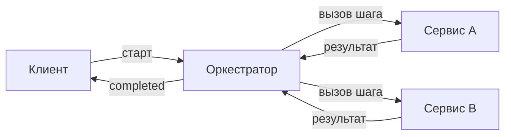

# Как составить пайплайн: руководство с нуля

Это пошаговое руководство для тех, кто впервые видит оркестратор. Мы пройдём путь от
клонирования репозитория до сложных цепочек с ветвлением. Никаких скрытых деталей —
каждый пример можно запустить.

## Содержание

1. [Что такое пайплайн](#1-что-такое-пайплайн)
2. [Запуск окружения](#2-запуск-окружения)
3. [Первый пайплайн из одного шага](#3-первый-пайплайн-из-одного-шага)
4. [Как устроена декларация](#4-как-устроена-декларация)
5. [Передача данных между шагами](#5-передача-данных-между-шагами)
6. [Зависимости между шагами](#6-зависимости-между-шагами)
7. [Что должен возвращать сервис](#7-что-должен-возвращать-сервис)
8. [Настройки шага: meta](#8-настройки-шага-meta)
9. [Фильтры: skip, end, error, goto](#9-фильтры-skip-end-error-goto)
10. [Middlewares: правка данных](#10-middlewares-правка-данных)
11. [Итоговые outputs](#11-итоговые-outputs)
12. [Сложные сценарии](#12-сложные-сценарии)
13. [Частые ошибки](#13-частые-ошибки)
14. [Чек-лист корректного пайплайна](#14-чек-лист-корректного-пайплайна)

---

## 1. Что такое пайплайн

Пайплайн — это описание цепочки шагов в формате JSON. Каждый шаг — это вызов
микросервиса по NATS. Оркестратор сам решает, в каком порядке запускать шаги, ждёт их
результаты, передаёт данные от одного шага к другому и в конце отдаёт итог.

Важно: оркестратор **не знает**, что делают ваши сервисы. Он только доставляет вызов и
получает ответ. Вся логика — внутри сервисов.



---

## 2. Запуск окружения

Клонируем репозиторий и поднимаем всё одной командой:

```bash
git clone <repo-url> orchestrator
cd orchestrator

cp .env.example .env          # значения по умолчанию работают сразу
docker compose up -d --build  # postgres + nats + миграции + оркестратор
```

Что произойдёт:

- поднимется PostgreSQL и NATS (с JetStream);
- контейнер `migration` применит схему БД через Alembic и завершится;
- оркестратор стартует и начнёт слушать `orchestrator.workflow.start`.

Готовый рабочий пример с двумя сервисами лежит в
[`examples/calculator`](../examples/calculator/) — рекомендуем сначала запустить его и
посмотреть, как всё работает вживую.

---

## 3. Первый пайплайн из одного шага

Самый маленький пайплайн — один шаг, который вызывает один сервис:

```json
{
  "message_version": "1.0",
  "pipeline_version": "1.0",
  "definition_key": "hello",
  "idempotency_key": "run-0001",
  "steps": [
    {
      "step_id": 1,
      "meta": {"target": "service.greet"},
      "data": {"name": "Иван"}
    }
  ]
}
```

Это тело отправляется в NATS на subject `orchestrator.workflow.start`. Оркестратор:

1. проверит декларацию,
2. создаст запуск (run),
3. отправит вызов на subject `service.greet` с полем `data`,
4. дождётся ответа сервиса.

Сервис `service.greet` получит вызов и должен ответить результатом (см. раздел 7).

---

## 4. Как устроена декларация

Поля верхнего уровня:

| Поле | Обязательное | Что это |
| --- | --- | --- |
| `message_version` | да | версия контракта, сейчас `"1.0"` |
| `pipeline_version` | да | версия языка декларации, сейчас `"1.0"` |
| `definition_key` | да | человекочитаемое имя пайплайна (например `order.fulfillment`) |
| `idempotency_key` | да | уникальный ключ запуска; повтор с тем же ключом не создаёт новый run |
| `business_ref` | нет | ваш бизнес-идентификатор (номер заказа, тикета) для удобства |
| `steps` | да | список шагов |
| `outputs` | нет | какие итоговые значения собрать в конце |

> `idempotency_key` защищает от дублей. Если клиент отправит старт дважды (например,
> из-за повторной попытки), оркестратор поймёт, что это тот же запуск, и не создаст
> второй.

Поля одного шага:

| Поле | Обязательное | Что это |
| --- | --- | --- |
| `step_id` | да | целое число, уникальное в пределах пайплайна |
| `meta` | да | настройки шага (минимум — `target`) |
| `data` | да | payload, который уйдёт в сервис (может быть пустым `{}`) |
| `depends_on` | нет | от каких шагов зависит этот шаг |
| `filters` | нет | условные правила маршрута |
| `middlewares` | нет | правка `data` до/после шага |

> Лишние поля запрещены. Если опечататься в названии поля, декларация будет отклонена —
> это специально, чтобы ошибки ловились сразу.

---

## 5. Передача данных между шагами

Шаг может взять значение из результата другого шага. Для этого в `data` пишется ссылка.

- `$N:путь` — взять поле `путь` из результата шага с `step_id = N`.
- `$имя` — взять локальное значение из `data` этого же шага.

Пример: шаг 2 берёт число из результата шага 1.

```json
{
  "steps": [
    {"step_id": 1, "meta": {"target": "service.calc"}, "data": {"expression": "6-9*8"}},
    {
      "step_id": 2,
      "meta": {"target": "service.assemble"},
      "depends_on": [{"node": 1, "policy": "requires_success"}],
      "data": {"value": "$1:value"}
    }
  ]
}
```

Если шаг 1 вернул результат `{"value": -66}`, то шаг 2 получит `data = {"value": -66}`.

Путь может быть вложенным: `$1:user.address.city` достанет `result["user"]["address"]["city"]`.

---

## 6. Зависимости между шагами

Поле `depends_on` говорит, что шаг должен ждать другие шаги. Есть две основные политики:

| Политика | Когда шаг запустится |
| --- | --- |
| `requires_success` | только если upstream-шаг завершился **успешно** |
| `requires_closed` | когда upstream-шаг **закрыт** в любом исходе (успех, пропуск, отказ) |

Короткая форма (по умолчанию `requires_success`):

```json
{"step_id": 2, "depends_on": [1], "meta": {"target": "service.b"}, "data": {}}
```

Полная форма:

```json
{
  "step_id": 3,
  "depends_on": [
    {"node": 1, "policy": "requires_success"},
    {"node": 2, "policy": "requires_closed"}
  ],
  "meta": {"target": "service.c"},
  "data": {}
}
```

Шаги без `depends_on` стартуют сразу и параллельно друг другу.

> Циклы запрещены. Если шаг A зависит от B, а B — от A, декларация будет отклонена.

---

## 7. Что должен возвращать сервис

Сервис получает вызов на свой subject (`meta.target`) и должен ответить сообщением на
`orchestrator.results`. Главное правило — **вернуть назад корреляционные поля без
изменений**: `run_id`, `node_key`, `step_run_id`, `attempt`.

Успешный ответ:

```json
{
  "message_version": "1.0",
  "definition_key": "calculator",
  "run_id": "...",
  "node_key": "step-1",
  "step_run_id": "...",
  "attempt": 1,
  "result": {"value": -66}
}
```

Ответ с ошибкой:

```json
{
  "error": {"failure_class": "business", "message": "деление на ноль"}
}
```

- `failure_class: "business"` — логический отказ; оркестратор применит `on_failure`.
- `failure_class: "transient"` — временный сбой; возможна повторная попытка по `retry_policy`.

То, что вы положите в `result`, и есть данные, доступные следующим шагам по `$N:поле`.
Например, `result = {"value": -66}` → следующий шаг возьмёт его как `$1:value`.

Готовый пример сервиса — [`examples/calculator/services/calculator.py`](../examples/calculator/services/calculator.py).

---

## 8. Настройки шага: meta

Минимум — это `target`. Остальное по необходимости:

```json
{
  "target": "service.translate",
  "transport_mode": "async_result_subject",
  "retry_policy": {"max_attempts": 3, "backoff_sec": [1, 5, 15], "result_wait_timeout_sec": 30},
  "on_failure": "fail",
  "valid_for_sec": 300
}
```

| Поле | Значения | Смысл |
| --- | --- | --- |
| `target` | строка | subject сервиса (по умолчанию разрешены префиксы `service.` и `meta.`) |
| `transport_mode` | `async_result_subject` / `fire_and_forget` | ждать ли результат |
| `retry_policy.max_attempts` | число | сколько всего попыток (включая первую) |
| `retry_policy.backoff_sec` | список чисел | паузы между попытками |
| `retry_policy.result_wait_timeout_sec` | число | сколько ждать ответ сервиса |
| `on_failure` | `fail` / `skip` / `abandon` | что делать, когда попытки исчерпаны |
| `valid_for_sec` | число | через сколько секунд шаг «протухает» (TTL) |

Поведение `transport_mode`:

- `async_result_subject` — оркестратор ждёт ответ на `orchestrator.results`.
- `fire_and_forget` — отправил и забыл; шаг считается выполненным сразу после отправки
  (полезно для уведомлений).

Поведение `on_failure`:

| Значение | Что происходит при отказе шага |
| --- | --- |
| `fail` | весь run переходит в `FAILED` |
| `skip` | шаг помечается пропущенным, run продолжается |
| `abandon` | шаг «брошен», run продолжается, но шаг не считается успешным |

---

## 9. Фильтры: skip, end, error, goto

Фильтр проверяет условие и, если оно истинно, меняет маршрут. Условие — это выражение,
где можно сослаться на результаты (`$N:поле`) и локальные данные (`$имя`).

```json
"filters": [
  {"filter_id": 1, "condition": "$1:score < 10", "then": "skip"}
]
```

Доступные действия `then`:

| `then` | Что делает |
| --- | --- |
| `skip` | пропустить текущий шаг |
| `end` | завершить весь run успешно прямо сейчас |
| `error` | завершить весь run как `FAILED` |
| `goto` | перепрыгнуть на указанные шаги (нужно поле `targets`) |

Пример `goto` — при низком приоритете сразу прыгаем на шаг 4, минуя 2 и 3:

```json
{
  "step_id": 1,
  "meta": {"target": "service.classify"},
  "data": {"ticket": "778"},
  "filters": [
    {"filter_id": 1, "condition": "$priority == 'low'", "then": "goto", "targets": [4]}
  ]
}
```

Шаги, которые оказались «в обход» (2 и 3), помечаются как пропущенные по GOTO.

---

## 10. Middlewares: правка данных

Middleware меняет `data` шага без участия сервиса: `before` — до вызова, `after` —
после получения результата.

```json
"middlewares": {
  "before": {"set": {"locale": "ru"}, "remove": ["debug"]},
  "after": {"set": {"checked": true}}
}
```

- `set` — добавить или перезаписать ключи (по dot-path, можно вложенные).
- `remove` — удалить ключи.

Это удобно, когда нужно подмешать константу или убрать служебное поле, не трогая сервис.

---

## 11. Итоговые outputs

`outputs` описывает, какие значения собрать в финальное событие `workflow.completed`.
Каждый output — это ссылка на результат шага.

```json
"outputs": {
  "answer": {"ref": "$2:text", "required": true},
  "notify_status": {"ref": "$3:status", "required": false, "default": "skipped"}
}
```

- `ref` — откуда брать значение (`$node:путь`).
- `required: true` — если значения нет, run завершится с ошибкой `OUTPUT_MISSING`.
- `required: false` + `default` — если значения нет, подставится `default`.

Эти значения придут клиенту в поле `outputs` события завершения.

---

## 12. Сложные сценарии

### Линейная цепочка A → B → C

Каждый следующий шаг зависит от предыдущего:

```json
{
  "definition_key": "linear",
  "idempotency_key": "run-linear-1",
  "steps": [
    {"step_id": 1, "meta": {"target": "service.a"}, "data": {}},
    {"step_id": 2, "meta": {"target": "service.b"}, "depends_on": [1], "data": {"x": "$1:value"}},
    {"step_id": 3, "meta": {"target": "service.c"}, "depends_on": [2], "data": {"y": "$2:value"}}
  ]
}
```

### Параллельный запуск, затем сборка

Шаги 1 и 2 без зависимостей стартуют параллельно; шаг 3 ждёт оба:

```json
{
  "definition_key": "fan-in",
  "idempotency_key": "run-fanin-1",
  "steps": [
    {"step_id": 1, "meta": {"target": "service.a"}, "data": {}},
    {"step_id": 2, "meta": {"target": "service.b"}, "data": {}},
    {
      "step_id": 3,
      "meta": {"target": "service.merge"},
      "depends_on": [1, 2],
      "data": {"left": "$1:value", "right": "$2:value"}
    }
  ]
}
```

### Ветвление по условию (goto)

```json
{
  "definition_key": "routing",
  "idempotency_key": "run-routing-1",
  "outputs": {"resolution": {"ref": "$4:status", "required": false, "default": "manual"}},
  "steps": [
    {
      "step_id": 1,
      "meta": {"target": "service.classify"},
      "data": {"ticket": "778"},
      "filters": [{"filter_id": 1, "condition": "$1:priority == 'low'", "then": "goto", "targets": [4]}]
    },
    {"step_id": 2, "meta": {"target": "service.triage"}, "depends_on": [1], "data": {}},
    {"step_id": 3, "meta": {"target": "service.assign"}, "depends_on": [2], "data": {}},
    {"step_id": 4, "meta": {"target": "service.autoclose"}, "depends_on": [3], "data": {}}
  ]
}
```

### Необязательный шаг, который можно пропустить

Шаг-уведомление: бросаем при сбое (`abandon`), не ждём результат (`fire_and_forget`),
а следующий шаг продолжает работу независимо от его исхода (`requires_closed`):

```json
{
  "definition_key": "with-optional",
  "idempotency_key": "run-optional-1",
  "steps": [
    {"step_id": 1, "meta": {"target": "service.work"}, "data": {}},
    {
      "step_id": 2,
      "meta": {"target": "service.notify", "transport_mode": "fire_and_forget", "on_failure": "abandon"},
      "depends_on": [{"node": 1, "policy": "requires_success"}],
      "data": {"message": "$1:summary"}
    },
    {
      "step_id": 3,
      "meta": {"target": "service.finish"},
      "depends_on": [{"node": 2, "policy": "requires_closed"}],
      "data": {}
    }
  ]
}
```

### Критичный шаг с повторами и TTL

```json
{
  "step_id": 1,
  "meta": {
    "target": "service.payment",
    "retry_policy": {"max_attempts": 3, "backoff_sec": [2, 5, 10]},
    "on_failure": "fail",
    "valid_for_sec": 120
  },
  "data": {"amount": 1000}
}
```

Если сервис не ответит за `valid_for_sec`, шаг протухнет; при бизнес-ошибке после трёх
попыток весь run станет `FAILED`.

---

## 13. Частые ошибки

| Симптом | Причина | Решение |
| --- | --- | --- |
| Декларация отклонена | лишнее или неверное поле | проверьте имена полей, лишние запрещены |
| Шаг не стартует | ждёт `depends_on`, который не закрылся | проверьте политики зависимостей |
| `$N:поле` не находится | сервис вернул другой ключ | сверьте, что лежит в `result` сервиса |
| run завис в ожидании | сервис не ответил на `orchestrator.results` | проверьте, что сервис эхо-возвращает корреляционные поля |
| run упал с `OUTPUT_MISSING` | `required` output без значения | сделайте output `required: false` с `default` или поправьте `ref` |
| Дубликат запуска | разные `idempotency_key` для одного и того же | используйте стабильный ключ для одной бизнес-операции |

---

## 14. Чек-лист корректного пайплайна

- [ ] `definition_key` и `idempotency_key` заданы.
- [ ] У всех шагов уникальные `step_id`.
- [ ] У каждого шага есть `meta.target` с разрешённым префиксом.
- [ ] Все `$N:поле` ссылаются на существующие шаги и реальные поля результата.
- [ ] `depends_on` не образует цикл.
- [ ] `goto.targets` указывают на существующие шаги.
- [ ] `outputs.ref` ведут на шаги, которые действительно выполнятся.
- [ ] Для необязательных шагов выбрана политика `on_failure` и зависимость `requires_closed`.

Дальше: нормативный контракт сервисов — в [CONTRACTS.md](CONTRACTS.md), эксплуатация и
admin-команды — в [OPERATIONS.md](OPERATIONS.md), точные правила состояний — в
[SEMANTICS.md](SEMANTICS.md).
